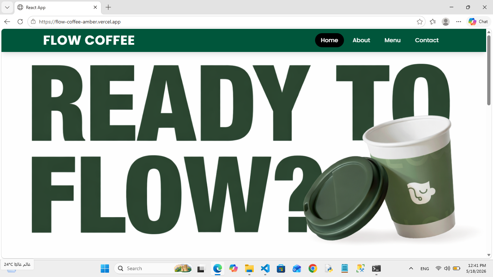
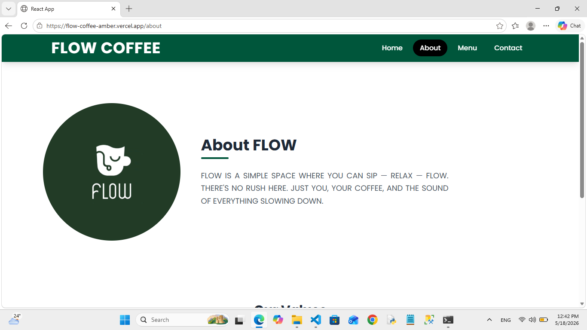
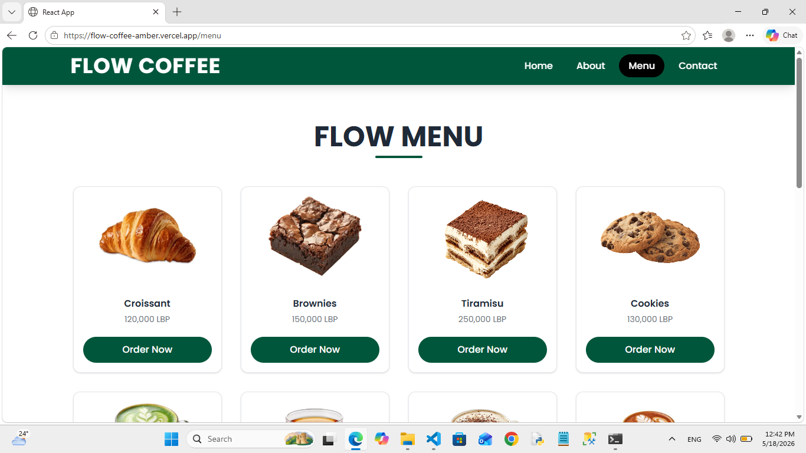
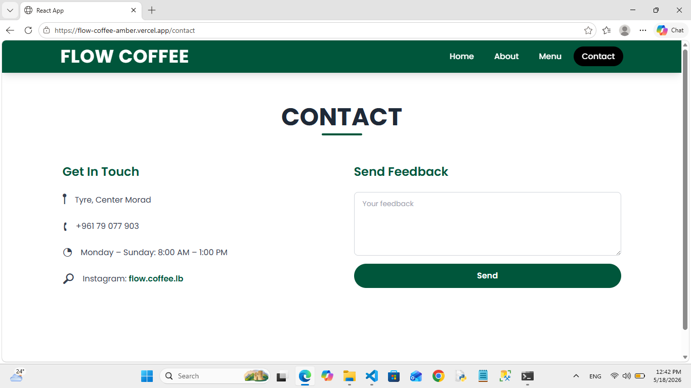

# Flow Coffee
> A React-based web application for Flow Coffee — a cozy café in Tyre, Lebanon.  
> Sip. Relax. Flow.
## Live Demo
https://flow-coffee-amber.vercel.app
---

## Project Description

Flow Coffee is a fully responsive, multi-page web application built with ReactJS and Tailwind CSS. It showcases the café's menu, story, gallery, and contact information. The app was developed as part of CSCI390: Web Programming — Project Phase 2.

---

##  Technologies Used

| Technology | Purpose |
|---|---|
| ReactJS | Frontend framework |
| React Router DOM | Client-side routing (4 pages) |
| Tailwind CSS | Responsive utility-first styling |
| GitHub Pages / Vercel | Deployment |

---

##  Setup Instructions

### Prerequisites
- Node.js 
- npm

### Installation


# 1. Clone the repository
git clone https://github.com/YOUR_USERNAME/flow-coffee.git

# 2. Enter the project folder
cd flow-coffee

# 3. Install dependencies
npm install

# 4. Start the development server
npm start
```

The app will open at http://localhost:3000.

### Build for Production

```bash
npm run build
```

---

## Deployment

### Deploy to Vercel

```bash
npm install -g vercel
vercel --prod
```

### Deploy to GitHub Pages

Add to package.json: "homepage": "https://YOUR_USERNAME.github.io/flow-coffee"

```bash
npm run build
npx gh-pages -d build
```

---

## Project Structure

```
flow-coffee/
├── public/             # Static assets (images)
├── src/
│   ├── components/
│   │   ├── Navbar.jsx  # Responsive nav with hamburger menu
│   │   └── Footer.jsx  # Site footer
│   ├── pages/
│   │   ├── Home.jsx    # Landing page with hero & gallery
│   │   ├── About.jsx   # About section and values
│   │   ├── Menu.jsx    # Full menu grid
│   │   └── Contact.jsx # Contact info and feedback form
│   ├── App.js          # Router and layout
│   └── index.css       # Tailwind CSS directives
├── tailwind.config.js
├── package.json
└── README.md
```

---

##  Screenshots

### Home


### About


### Menu


### Contact
